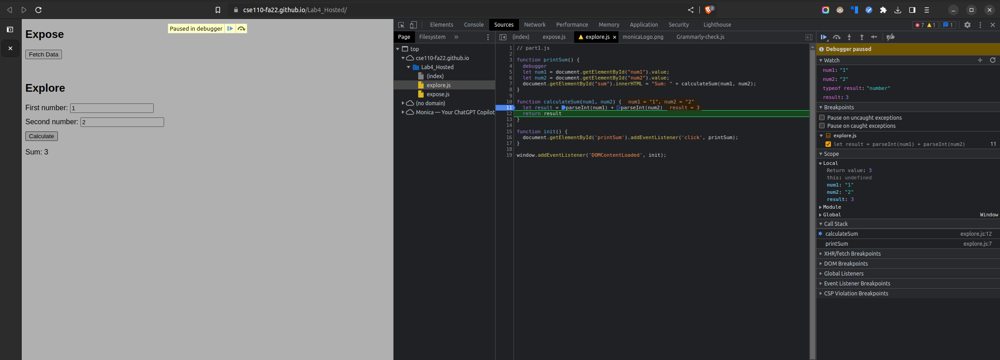

# DevTools - Debugging

1. The bug was that `num1` and `num2` are strings, so they were being
   concatenated instead of added.
2. The fix was to convert them to numbers using `parseInt()`.

## Screenshots

`result-calculateSum.png`

`result-dataType.png`

`fix.png`

